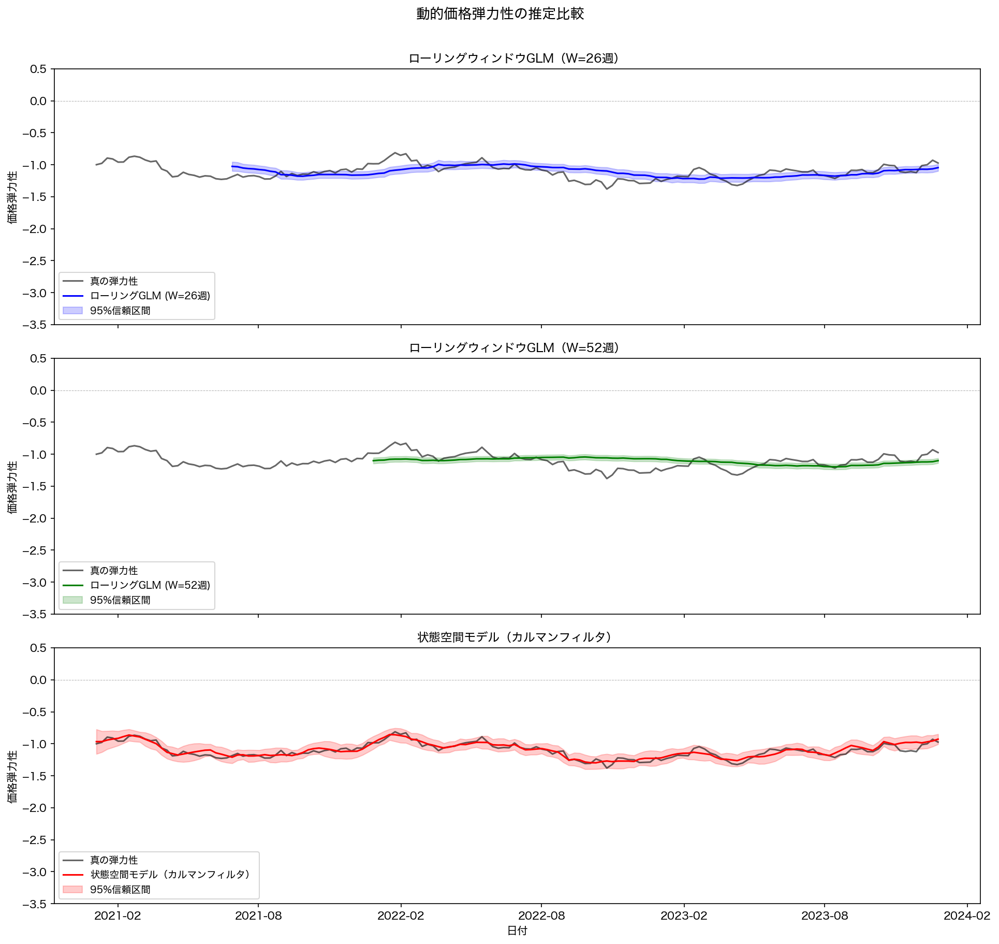

# 動的価格弾力性モデル：時変する価格感応度をPythonで推定する（ローリングGLM・状態空間モデル）

## はじめに

この記事は、**価格分析・需要予測に携わるデータサイエンティスト**を対象としています。前回の記事「価格弾力性をlogリンク関数でモデリングする」で扱ったlog-log GLMの知識を前提とします。GLMの基礎は理解しているが、「弾力性は本当に一定なのか？」という疑問を持ったことがある方に特に有益な内容です。

弾力性モデルに基づいて値上げを提案したところ、想定を超える需要の落ち込みが起きた。競合他社の参入後から、以前のモデルの予測が外れるようになった。──これらは弾力性そのものが時間とともに変化しているサインかもしれません。静的モデルは「弾力性は全期間で一定」と仮定するため、こうした変化を捉えられず、気づかないまま誤った価格判断を積み重ねることになります。

この記事を読むと、以下のことが理解できます。

- 弾力性が時間とともに変化するビジネス事例と、静的モデルの限界
- 動的弾力性を推定する2つのアプローチ：**ローリングウィンドウGLM**と**状態空間モデル（カルマンスムーサー）**
- 各アプローチの実装概要とシミュレーションによる検証結果
- 実務で動的弾力性をどう使うか

第1章・第2章は概念と理論です。実装を急ぐ方は**第3章から読み始めても問題ありません**。

---

## 第1章: 静的弾力性の限界と動的弾力性が必要なケース

### 1.1 静的モデルの仮定

前回の記事で扱ったlog-logモデルは以下の形でした。

$$\log(E[Q_t]) = \alpha + \beta \log(P_t)$$

ここで $\beta$（価格弾力性）は**全期間を通じて一定**と仮定しています。これは「消費者の価格感応度は変わらない」という強い前提です。

### 1.2 弾力性が変化する現実のシナリオ

実務では弾力性が時間的に変化するケースが頻繁に発生します。

| シナリオ | 弾力性への影響 |
|---|---|
| **競合参入** | 代替品が増え、消費者が価格比較しやすくなる → 弾力的になる |
| **ブランド毀損** | 品質問題・スキャンダルで消費者の信頼が低下 → 弾力的になる |
| **景気後退** | 消費者の財布のひもが固くなる → 弾力的になる |
| **プレミアム化成功** | ブランドロイヤルティが高まる → 非弾力的になる |
| **季節性** | セール期は価格感応度が高まる → 季節的に変動 |

**事例**: あるECプラットフォームで競合他社が参入した前後を静的モデルで分析すると、前後の期間がひとつの弾力性に平均化され、参入の影響を正しく捉えられません。

### 1.3 静的モデルを使い続けるリスク

```
静的弾力性 β = -1.2（全期間平均）

実態:
  参入前: β = -0.7（非弾力的）
  参入後: β = -1.8（弾力的）

→ 参入後に静的モデルで「まだ値上げできる」と判断すると
  実際には需要が大きく落ちるという意思決定ミスが発生する
```

---

## 第2章: 動的弾力性モデルのアプローチ比較

### 2.1 ローリングウィンドウGLM

最もシンプルなアプローチです。時点 $t$ の弾力性を、直近 $W$ 期間のデータで推定します。

$$\hat{\beta}_t = \underset{\beta}{\arg\min} \; \mathcal{L}\left(\{Q_s, P_s\}_{s=t-W+1}^{t}\right)$$

- **メリット**: 実装が簡単、解釈が直感的
- **デメリット**: ウィンドウサイズ $W$ の選択が恣意的。過去のデータをすべて等しく扱い、古いデータを急に切り捨てる

### 2.2 状態空間モデル（カルマンフィルタ）

弾力性 $\beta_t$ を**隠れた状態変数**としてモデリングします。

**観測方程式**（需要の観測式）:

$$y_t = \alpha_t + \beta_t x_t + \varepsilon_t, \quad \varepsilon_t \sim \mathcal{N}(0, \sigma^2_\varepsilon)$$

**状態遷移方程式**（弾力性のランダムウォーク）:

$$\begin{pmatrix} \alpha_t \\ \beta_t \end{pmatrix} = \begin{pmatrix} \alpha_{t-1} \\ \beta_{t-1} \end{pmatrix} + \begin{pmatrix} \eta_{\alpha,t} \\ \eta_{\beta,t} \end{pmatrix}, \quad \boldsymbol{\eta}_t \sim \mathcal{N}(\mathbf{0}, \mathbf{Q})$$

ここで $y_t = \log(Q_t)$、$x_t = \log(P_t)$ です。

ざっくり言うと「弾力性は毎期ランダムに少しずつ動きながら、それが需要量として観測される」という構造です。カルマンフィルタはこの構造を利用して、観測データから隠れた弾力性の軌跡を逆算します。

- **メリット**: すべての過去データを使いつつ、直近を重視する重み付けが自動的に行われる。推定値の不確実性（信頼区間）が自然に得られる
- **デメリット**: 実装がやや複雑。分散パラメータ（$\sigma^2_\varepsilon$, $\mathbf{Q}$）の推定が必要

### 2.3 アプローチの選択指針

| 観点 | ローリングウィンドウ | 状態空間モデル |
|---|---|---|
| 実装の容易さ | 高い | やや複雑 |
| 推定の統計的効率性 | 低い（データの切り捨て） | 高い（全データ活用） |
| 不確実性の定量化 | 可能（信頼区間） | 自然に得られる |
| 変化の滑らかさ | 不連続（ウィンドウ端） | 滑らか |
| 推奨場面 | 探索的分析・プロトタイプ | 本番モデル・精緻な分析 |

---

## 第3章: 検証の設計と実装概要

実装コードは `verify.py` に一括して掲載しています。この章では各処理の設計意図と得られた結果を説明します。

### 3.1 シミュレーションデータの設計

弾力性が時間変化するシナリオを再現するため、以下のパラメータで週次データを生成しました。

| パラメータ | 設定値 | 意味 |
|---|---|---|
| 期間 | 156週（3年） | 2021年1月〜2023年12月 |
| 初期弾力性 β₀ | −1.0 | 開始時点の価格感応度 |
| 週次ドリフト | −0.001 | 競合悪化による緩やかな弾力化 |
| 状態ノイズ σ_state | 0.05 | 週ごとの弾力性の不規則変動 |
| 観測ノイズ σ_obs | 0.02 | 需要量の計測誤差 |
| 価格範囲 | 200〜400円 | 週ごとにランダムに変動 |
| 基準価格（中心化） | 300円 | log_price = 0 に対応する基準点 |

真の弾力性はドリフト付きランダムウォークで生成し、3年間で **−1.0 から約 −1.2** へと変化しました（週次ノイズにより実際の軌跡は不規則に変動します）。対数需要量は次の式で生成しました。

$$\log(E[Q_t]) = \log(1000) + \beta_t \cdot \log\!\left(\frac{P_t}{300}\right)$$

観測ノイズを小さめ（σ=0.02）に設定しており、推定アルゴリズムの性能差が数値として現れやすい「教科書的なクリーンデータ」の設定です。

### 3.2 ローリングウィンドウGLM

各時点 $t$ において直近 $W$ 週のデータでPoisson GLM（logリンク）を推定し、`log_price` の係数を弾力性として記録します。推定が始まるのは $W$ 週目以降です。今回は **W=26週（半年）** と **W=52週（1年）** の2つのウィンドウサイズで推定を行い、短いウィンドウと長いウィンドウのトレードオフを比較しました。

### 3.3 状態空間モデル（カルマンスムーザー）

`statsmodels` の `MLEModel` を使ってカスタム状態空間モデルを構築しました。実装は次の3つのコンポーネントで構成されます。

1. **観測行列（時変）**: 各時点で $Z_t = [1, \log(P_t/300)]$ を設定し、状態ベクトル $[\alpha_t, \beta_t]$ との積が対数需要量に対応するよう構成
2. **状態遷移行列**: 単位行列 $I_2$（ランダムウォーク）
3. **分散パラメータの推定**: 観測誤差分散 $\sigma^2_\varepsilon$、切片ドリフト分散 $\sigma^2_\alpha$、弾力性ドリフト分散 $\sigma^2_\beta$ の3つを L-BFGS で最尤推定

推定後は**カルマンスムーザー**（全期間データを前後に活用する双方向平滑化）で各時点の弾力性を復元しました。リアルタイム監視には片側のカルマンフィルタを使うのに対し、過去データの回顧的分析にはスムーザーのほうが精度が高くなります。

### 3.4 結果の可視化

下図は3つのモデルの推定結果と真の弾力性（黒線）を比較したものです。



各パネルの観察ポイントを以下に整理します。

| モデル | 特徴的な挙動 |
|---|---|
| **ローリングGLM（W=26週）** | 変化への追従は速いが、推定値のノイズが大きく真値から外れる週が多い |
| **ローリングGLM（W=52週）** | 推定値は安定するが、変化への追従が遅く全体的に平滑化されすぎる |
| **状態空間モデル** | 全データを双方向に活用するため、真値に近い滑らかな軌跡を復元 |

### 3.5 推定精度の定量比較

各モデルの RMSE（真の弾力性との二乗平均平方根誤差）を計算した結果を以下に示します。

| モデル | RMSE |
|---|---|
| ローリングGLM（W=26週） | 0.1039 |
| ローリングGLM（W=52週） | 0.1284 |
| **状態空間モデル（カルマンスムーザー）** | **0.0462** |

状態空間モデルは W=26週比で RMSE が約 **56% 低く**、W=52週比では約 **64% 低く**なりました。

この結果は第2章の理論的な説明を裏付けています。ローリングGLMが過去 $W$ 週を等重みで扱うのに対し、カルマンスムーザーは各時点の弾力性を「前後の全データから最適に復元」するという根本的な違いが精度の差として現れています。

なお、今回の RMSE はデータ生成と推定モデルが同じ「ランダムウォーク」仮定を共有する理想的なシナリオでの結果です。現実のビジネスデータでは真の弾力性は未知であるため、予測精度（ホールドアウト検証）で比較することになります。

---

## 第4章: 実務での活用ポイント

### 4.1 ウィンドウサイズの選択（ローリングGLM）

ウィンドウサイズは **バイアスとバリアンスのトレードオフ**です。

- **短すぎる**（例: 8週）: 推定が不安定でノイジー。偽の変化を検出しやすい
- **長すぎる**（例: 104週）: 変化への追従が遅く、実態から乖離する

選択の実践的な方法としては、`sklearn` の `TimeSeriesSplit` を使った時系列クロスバリデーションが有効です。候補のウィンドウサイズ（例: 13・26・39・52週）それぞれについて5分割時系列CVを行い、テスト期間の対数需要 RMSE が最小になるサイズを採用します。変化が速い商品カテゴリでは短いウィンドウ（13〜26週程度）が有効なことが多く、安定したカテゴリでは長いウィンドウが適する傾向があります。

### 4.2 推定した動的弾力性をビジネスに活用する

動的弾力性の実践的な使い方を3つ示します。

**① 値付け判断のアラート**

状態空間モデルの推定結果から最新時点の弾力性と95%信頼区間下限を取得し、下限が事前に定めた閾値（例: −1.5）を下回った場合に「価格感応度が高まっているため値上げは慎重に」というアラートを発出します。推定値の点推定だけでなく不確実性も考慮できる点が、状態空間モデルならではの強みです。

**② 弾力性に応じた動的値付け（Dynamic Pricing）**

Lerner指数に基づく理論的最適価格は次の式で求められます。

$$P^* = \frac{MC}{1 + \dfrac{1}{E}}$$

ここで $MC$ は限界費用（原価）、$E$ は推定弾力性（$E < -1$ の場合のみ有効）です。たとえば弾力性 $E=-2$ のとき最適価格は原価の2倍、$E=-1.5$ なら原価の3倍になります。動的弾力性を用いることで、時期や競合環境に応じて最適マークアップ率をリアルタイムに更新できます。

**③ 弾力性変化の構造変化点検出**

`ruptures` ライブラリの Pelt アルゴリズムを弾力性の時系列に適用することで、弾力性が大きく変化した時点を自動検出できます。RBFカーネルをコスト関数として用い、ペナルティパラメータで変化点数を制御します。競合参入や大型プロモーションの前後での弾力性変化を客観的に特定するのに有用です。

---

## まとめ

この記事では、弾力性が時間とともに変化することを前提とした**動的価格弾力性モデル**を解説しました。

- **静的モデルの限界**: 競合環境・景気・消費者行動の変化により弾力性は変動する
- **ローリングウィンドウGLM**: 実装が容易。ウィンドウサイズはCV等で選択する
- **状態空間モデル（カルマンフィルタ）**: 統計的に厳密。全データを活用し滑らかな弾力性推定が得られる
- **検証結果**: シミュレーションデータでのRMSEは状態空間モデルがローリングGLMを56〜64%上回った
- **実務活用**: 値上げリスクのアラート・動的値付け・構造変化検出に応用できる

### 次のステップ

- **階層ベイズモデル**: 複数商品・SKUの弾力性を同時に推定し情報を借用する
- **操作変数法（IV）との組み合わせ**: 動的弾力性の内生性バイアスを補正する
- **非線形状態空間モデル**: 弾力性が急激に変化するケースへの対応（粒子フィルタ等）

---

## 参考文献

- Durbin, J., & Koopman, S. J. (2012). *Time Series Analysis by State Space Methods* (2nd ed.). Oxford University Press.
- Harvey, A. C. (1990). *Forecasting, Structural Time Series Models and the Kalman Filter*. Cambridge University Press.
- Tellis, G. J. (1988). The price elasticity of selective demand: A meta-analysis of econometric models of sales. *Journal of Marketing Research*, 25(4), 331–341.
- Hanssens, D. M., Parsons, L. J., & Schultz, R. L. (2001). *Market Response Models: Econometric and Time Series Analysis*. Kluwer Academic Publishers.
- Statsmodels Documentation — State Space Models: https://www.statsmodels.org/stable/statespace.html
- Statsmodels Documentation — MLEModel: https://www.statsmodels.org/stable/generated/statsmodels.tsa.statespace.mlemodel.MLEModel.html
