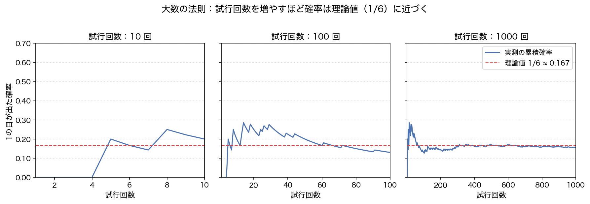
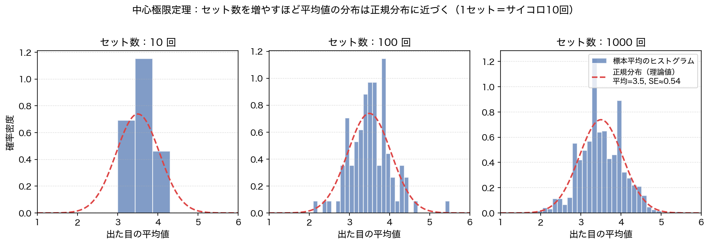
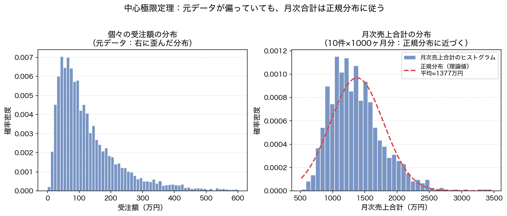

# データ社会を生き抜く営業の次世代感覚論：大数の法則と中心極限定理

どこの会社でもそうだと思いますが、営業担当は「来期の売上見積」を会社に提出することがあります。営業担当の頭を悩ませる業務の一つですね。
昭和や平成の時代なら「顧客Aはずっとお付き合いがあるから、来期も同じくらい」や「顧客Bはいつも通り購入してくれてるけど、この前御用聞きしに行ったら、はぐらかされたから、少なめで」などなど...。営業のこれまでの活動内容と顧客との付き合い内容から **感と経験** を元にして数字を叩き出します。もちろんこの時に **気合いと根性** も必要でしょう。

この過程を経て
> 「来期の売上見積もりはX万円です」  
> 「本当にこんな数字到達できるのか？」  
>「必ず到達できるようグループ一丸となって頑張ります」

という言葉が会議内で飛び交います。

しかし、令和のデータ社会および、より不確実な社会になった今日では、-- もちろん今でも **感と経験や気合いと根性** は今でも必要だと思いますが、-- 「データでものを語れるようになれ」などの社内からの圧力もあろうかと思います。でも「そんな急に言われても...。」や「データとか言われても、私には数学は無理だ」という声もあろうかと思います。

この記事はそんな人に向けた記事になっています。この記事では **高度な理論を使わずに高校生で学ぶ理論を使って** データで来期の売上見積を考えてみる足掛かりを目指しています。

## この記事の対象ペルソナ
- 若手と重鎮の間に挟まれデータ社会への適用性に悩みを抱える営業担当・企画部担当

## この記事で得られる結果
- 来期の売上予測の **気合いと根性** をより強く言い切れる
- 「来期売上はX万円に到達する確率が90%です。努力目標として確率50%で到達するY万円を目指します」と説得力をつけて説明できる
- これらの資料を **高校生で学ぶ理論で** エクセルベースで作成できる

## 高校生で学ぶ理論
ここでは"高校生"らしく「サイコロ」を使った例で理論を紹介します。もちろん後で売上見積との接続のご紹介は行うのでご心配なく。

### 大数の法則

1から6の目をもつサイコロを1回振ります（1回の試行）。この結果として得られるのは1から6のうちどれかになります。1回目の試行で1の目が出たとしましょう。この時出る目の確率は、分子に出た目の数、分母に試行回数とすると、1/1、2の目は0/1、...、6の目は0/1となります。これを100回同じサイコロを降ったとします（100回の試行）。そうするとそれぞれの出る目の確率は、みなさんご存知の通り1/6に確率的に収束します。

このように **理論的・理屈的にそうと言える確率と比べて、最初はずれていたとしても試行回数を大きくしていけば、その理論値に確率的に収束する** ことを大数の法則と言います。（かなり咀嚼した説明をしていますので、正式な説明からはややずれています。）



### 中心極限定理

今度は試行によってサイコロの出た目に着目します。具体的には、サイコロを「複数回まとめて振るセット」で考えてみましょう。例えば、サイコロを10回振って出た目の平均を記録します。1の目が2回、2の目が1回...といった具合に計算すると、1セット目の平均値が出ます。同じセットを100回繰り返すと、100個の「平均値」が集まります。1セット目は平均3.2、2セット目は平均3.7、3セット目は平均3.4...という具合です。

この100個の平均値をヒストグラム（棒グラフ）にしてみると、平均3.5あたりに集まり、左右対称のなだらかな山の形になってきます。これがいわゆる**正規分布**（釣り鐘型の分布）です。セット数を1000回、10000回と増やすほど、より正規分布の形にきれいに近づいていきます。

これの何が興味深いかというと、「サイコロはどの目も同じ確率で出る（一様分布）」という、正規分布とはまったく形の違う分布から始めているのに、その平均を集めると正規分布に近づくという点です。これを**中心極限定理**と言います。（ここでも噛み砕いた説明をしていますので、正式な定義からはやや省略しています。）



### 売上見積との接続

サイコロを例に大数の法則と中心極限定理を確認しましたが、これを売上見積に結びつけてみましょう。

**大数の法則との接続**

「1の目が出る確率は1/6」というサイコロの理論値に相当するのが、営業現場では「顧客Aの月次売上の真の平均」です。もちろんこの真の平均は誰にも分かりません。しかし、月ごとの売上を記録し続けることで——大数の法則が示すように——そのデータ平均は徐々に「真の平均」に近づいていきます。36ヶ月分（3年間）の実績があれば、そのデータから計算した平均値はかなり信頼できる推定値になっている、と考えてよいでしょう。

**中心極限定理との接続**

「サイコロを10回振って出た目の総和」と「サイコロを10回振って出た目の平均」に相当するのが、「月次売上額」と「月次の平均売上額」です。その月次売上を36ヶ月分集めると、それは「毎月の受注の合算値を36回分集めたもの」に相当します。中心極限定理が保証するのは、このように集めた月次売上の集まりが正規分布に近づくということです。

つまり、**十分な月数の売上実績さえあれば、その平均と標準偏差から正規分布を使った確率計算が成り立ちます。**



## 中心極限定理がなぜ便利なのか
先ほどのサイコロは「どの目も同じ確率で出る」という、実社会の実業務ではなかなか考えにくいきれいな形の一様分布でした。では、実際の営業現場のデータはどうでしょうか。

たとえば顧客Aから月に複数回受注を受けているシーンを考えます。この月次受注額を過去3年間（36ヶ月）グラフにしてみると、多くの月は100万円前後に固まっているけれど、年に1〜2回、大口発注が入って500万円を超える月がある——そんな形になることが多いのではないでしょうか。これは右側の裾が長く伸びた、**正規分布とはかけ離れた形**をしています。

「こんな偏ったデータじゃ、数学的な分析なんてできないのでは？」と思うかもしれません。ところが、中心極限定理の真価はここにあります。

**元のデータがどんな形の分布であっても、多数のデータの平均を集めると、その平均の分布は正規分布に近づきます。**

これは一様分布（サイコロ）だけでなく、売上実績データのような右に裾が長い分布でも成り立ちます。このような分布であっても「月次売上の平均」という操作を多数回繰り返すにつれ、その平均値の集まりは正規分布の形に近づいていくのです。

正規分布は「確率を計算しやすい」という大きな特徴があります。「来期の平均売上が○万円以上になる確率は何%か」という問いに答えるための道具が、正規分布を前提とすれば手元にそろいます。「うちの売上データは変な形だからデータ分析できない」は誤りで、一定数の取引実績があれば分析の土台はしっかりある、と考えてもいいと思います。

## 中心極限定理を使った売上見積の作り方
ここでは過去の月次売上データを使って、「来期の平均売上が目標金額を超える確率」をエクセルだけで計算する方法を紹介します。

### ステップ1：平均と標準偏差を計算する

まず、過去の月次売上データから平均値と標準偏差を計算します。エクセルで使う関数は次の2つです。

```text
平均値  ＝ AVERAGE(B2:B37)    ← 36ヶ月分のセル範囲を指定
標準偏差 ＝ STDEV.S(B2:B37)
```

例として、過去36ヶ月の月次売上の平均が **150万円**、標準偏差が **30万円** だったとします。

### ステップ2：目標金額を達成できる確率を求める

「来期の月次売上が180万円以上になる確率」を求めるには、`NORM.DIST` 関数を使います。

```text
= 1 - NORM.DIST(180, 150, 30, TRUE)
```

この式の意味は「180万円 **以下** になる確率を1から引く」＝「180万円 **以上** になる確率」です。上の例では約 **16%** という結果になります。「来期180万円を月次で超えられる確率は16%」と説明できます。

### ステップ3：確率を先に決めて、目標金額を逆算する

逆に「50%の確率で達成できる売上目標は？」や「90%の確率で達成できる現実的な下限は？」を知りたいときは `NORM.INV` 関数を使います。

```text
50%の確率で達成できる目標 ＝ NORM.INV(0.5, 150, 30)  → 150万円
90%の確率で達成できる下限 ＝ NORM.INV(0.1, 150, 30)  → 約112万円
```

「来期売上は90%の確率で112万円以上、努力目標として50%の確率で到達できる150万円を目指します」——こうした言い方ができるようになります。冒頭で目指していた「気合いと根性」に、確率という客観的な軸が加わった状態です。

## このモデルの落とし穴
ここまで紹介したモデルはシンプルで強力ですが、使う際に知っておくべき限界があります。

### 落とし穴1：中心極限定理はあくまで「平均の分布」の話

大事な前提として、中心極限定理が保証するのは「標本平均の分布が正規分布に近づく」ということです。元の売上データの分布が変わるわけではありません。

月次売上が右に裾の長い分布に従っている場合、実際の売上には「稀に非常に大きな値が出る」という性質が残り続けます。正規分布を使った見積もりは平均まわりのリスク評価には使えますが、稀に起こりうる大幅な上振れを見積もりに反映するには、元の分布の形も念頭に置く必要があります。売上に限った話をすれば、上振れで見積が外れることは良いことですが...。

### 落とし穴2：複数顧客の合計売上に使うときは注意

このモデルは「1人の顧客の売上」を対象にする場合は比較的素直に使えます。問題が生じるのは、複数顧客の合計売上に適用するときです。

中心極限定理の前提には「各データが互いに独立している（1人の顧客の動向が他の顧客に影響しない）」という条件があります。しかし現実には、同じ業界の顧客が一斉に受注を絞ったり、景気に連動して複数顧客が同時に動いたりすることがあります。顧客間の受注が連動する度合い（共分散）が大きくなると、合計売上の変動幅は正規分布を使った見積もりより大きくなります。例えば経済が大きく不況に陥った場合、モデルが想定している以上に売上が下ブレするリスクが生じます。

この現象は金融の世界で繰り返し確認されています[^1][^2][^3]。2008年のリーマンショックやCOVID-19拡大時には、これまで独立に動いていたとされていた様々な資産・業種が一斉に悪化しました。「それぞれ別々に動くから安全」と思っていたポートフォリオが危機時に一斉に崩れる——この共分散の急増が想定外の損失を生む構造は、営業の売上見積でも同様に起こりえます。

**このモデルを使う際の指針：**

- 単一顧客の月次売上見積：比較的安心して使える
- 複数顧客の合計売上見積：顧客間の業界連動リスクを別途考慮する
- 不況シナリオ：「通常時よりリスクが広がる」という補正を加えて保守的に見積もる

## まとめ

「感と経験」や「気合いと根性」は営業の現場で今も大切な力です。そこに確率という客観的な軸が加わることで、社内説明の説得力が増し、チームでリスク認識をそろえやすくなります。
数学が苦手という方も、「大数の法則でデータが信頼できる量に育つ」「中心極限定理のおかげで正規分布が使える」という2点を押さえれば、今日からエクセルで確率的な売上見積を始められます。

## 参考文献

[^1]: Longin, F. & Solnik, B. (2001). "Extreme Correlation of International Equity Markets." *The Journal of Finance*, 56(2), pp. 649–676. <https://doi.org/10.1111/0022-1082.00340>
[^2]: Kotkatvuori-Örnberg, J., Nikkinen, J. & Äijö, J. (2013). "Stock market correlations during the financial crisis of 2008–2009: Evidence from 50 equity markets." *International Review of Financial Analysis*, 28, pp. 70–78. <https://doi.org/10.1016/j.irfa.2013.01.009>
[^3]: Wu, J., Zhang, C. & Chen, Y. (2022). "Analysis of risk correlations among stock markets during the COVID-19 pandemic." *International Review of Financial Analysis*, 83, 102220. <https://doi.org/10.1016/j.irfa.2022.102220>
