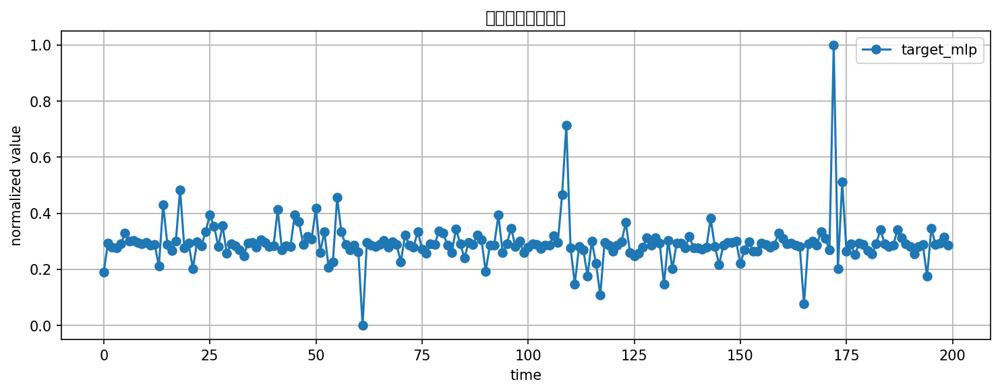
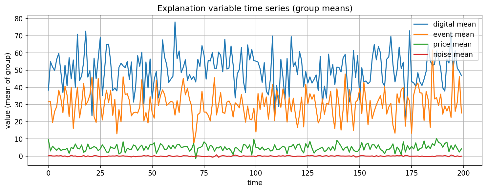
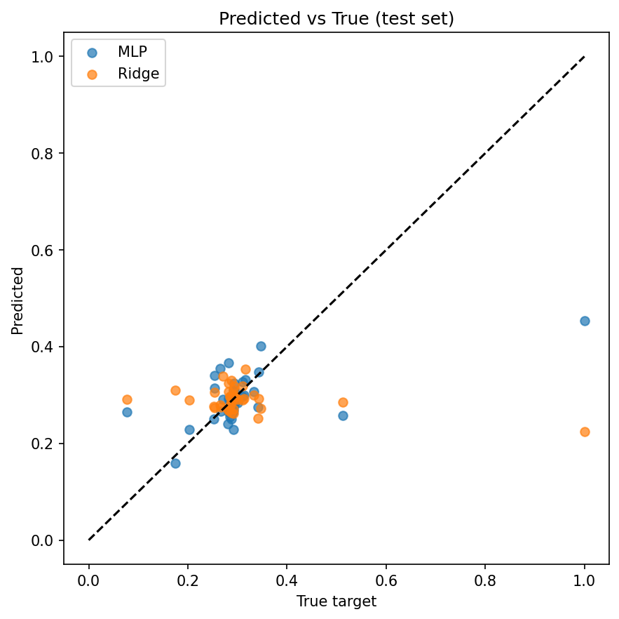
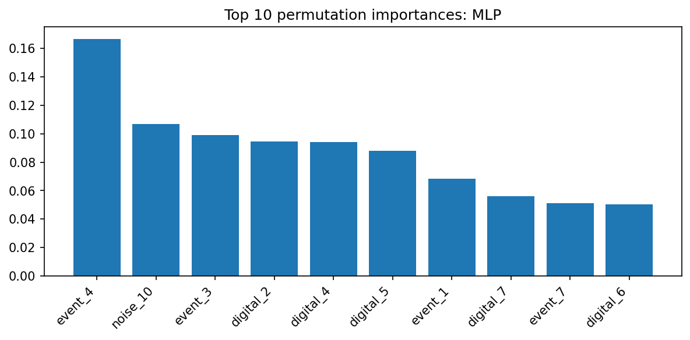
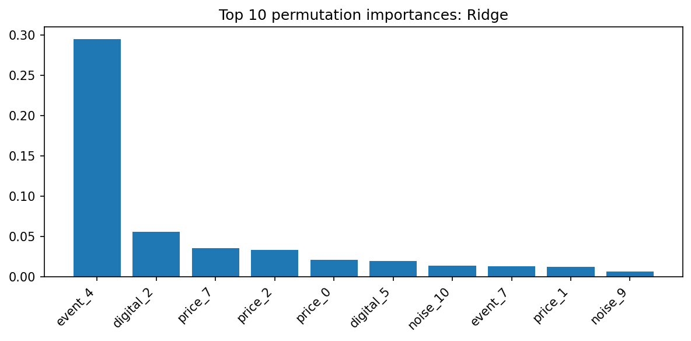

# MLPで非線形回帰に挑む：少ないデータでRidgeを超えるための設計と実装

## はじめに

「月次KPIデータが30〜50本あるのに、観測数は2〜3年分しかない。Ridge回帰を使っているが、どうしても予測精度が頭打ちになる」

こうした状況は、製造業・マーケティング分析の現場で珍しくありません。変数同士が互いに連動しているため多重共線性が生じやすく、かつデータが少ないために過学習のリスクも高い。そのうえ、KPI間の非線形な相互作用（「価格が一定水準を超えると販促効果が急落する」など）が予測精度の足を引っ張っていることもあります。

こうした課題に対して、**多層パーセプトロン（MLP）** による回帰は有力な選択肢の一つです。MLPは非線形な関係や変数間の交互作用を自動的に捉える能力を持ちます。ただし「とりあえずMLPを使えばよい」というわけではなく、**前処理・交差検証・正則化の設計**が結果を大きく左右します。

この記事では、モックデータを使いながら以下を手を動かして確認します。

- 少サンプル・多変数・多重共線性という実務的な難題をどう設定するか
- scikit-learnでMLP + GridSearchCVを正しく実装する方法
- Ridgeとの比較を通じてMLPの優位性が現れる条件
- Permutation Importanceで結果をステークホルダーに説明する方法

検証コードはGitHubで公開しています。

[mlp_regression.py](https://github.com/WE1CH-KAZU/qiita_samples/blob/main/mlp-regression/mlp_regression.py)

---

## 第1章：問題設定とモックデータの設計思想

### どんな状況を再現するか

今回のモックデータはMLPとRidge回帰との比較を行うため、以下の条件を意図的に設計しています。

- **観測数**: 200件（テストは末尾40件）
- **説明変数**: 40変数（digital系・event系・price系・noise系の4グループ）
- **多重共線性**: 3つの潜在因子から複数の説明変数を生成することで再現
- **非線形性**: 目的変数にsin・cos・tanh・3乗などを組み合わせ、MLPが有利になる構造を意図的に注入

潜在因子 `digital`、`event_sales`、`price_cond` からそれぞれ8変数ずつ派生させることで、グループ内の変数は互いに高相関になります。これは実務でよくある「施策グループ内のKPIがまとめて動く」状況に対応しています。

目的変数 $y$ は以下のような式で生成しています。

$$
y_{\text{cont}} = \sin(1.5 \cdot d) \cdot |d| + (\cos(1.2 \cdot e))^2 \cdot e - 0.6p + \frac{1.2(de)^2}{1+|de|} + 0.7\tanh(1.4dp) + 0.9 d^3 \cdot \text{sign}(e) + \varepsilon
$$

ここで $d$, $e$, $p$ はそれぞれ潜在因子 `digital`、`event_sales`、`price_cond` を指します。

### モックデータの意図

非線形モデルの検証では、**「そもそも非線形性がデータに存在するか」** が前提になります。線形な構造を持つデータでMLPとRidgeを比べても、差はほとんど出ません。

検証の公正さを保つために、「MLPが有利になるよう仕込んだデータで実験している」という前提をここで明示しておきます。





---

## 第2章：MLPの仕組みをざっくり理解する

### 順伝播の流れ

MLPは入力 $x$ を受け取り、重み行列 $W$ とバイアス $b$ で線形変換したあと、**活性化関数** $\phi$ で非線形変換を加える操作を層ごとに繰り返します。1層の隠れ層を持つ例では次のようになります。

$$
z = W^{(1)} x + b^{(1)}, \quad h = \phi(z), \quad \hat{y} = W^{(2)} h + b^{(2)}
$$

この活性化関数 $\phi$ があることで、線形モデルには表現できない非線形な関係を学習できます。scikit-learnの `MLPRegressor` では `relu`（負の値をゼロにカット）と `tanh`（-1〜1の滑らかなS字）が使われるケースが多いです。

### 損失関数とL2正則化

学習には **MSE + L2正則化** を最小化します。

$$
\min_{\theta} \frac{1}{n}\sum_{i=1}^n (y_i - \hat{y}_i(\theta))^2 + \alpha \|\theta\|_2^2
$$

$\alpha$ はL2正則化の強さを制御するハイパーパラメータです。$\alpha$ が大きいほど重みの絶対値が小さくなり、過学習を抑制します。少サンプルの状況では特に重要です。

### なぜ標準化が必須か

MLPの学習では、勾配降下法を採用しています。勾配降下法は、各特徴量のスケールに敏感です。スケールが大きい変数の勾配が支配的になり、収束が遅くなったり不安定になったりします。そのため**StandardScalerで事前に平均0・標準偏差1に変換する**ことが必須です。

---

## 第3章：時系列クロスバリデーションとハイパーパラメータ探索

### 時系列データの交差検証

時系列データではランダムなK分割交差検証法だと**リーケージ**（未来の情報が学習に混入する問題）を引き起こします。

本実装では `KFold(n_splits=4, shuffle=False)` を使い、データの時間的な順序を保ったまま分割しています。

### GridSearchCVで探索するパラメータ

隠れ層のニューロン数がハイパーパラメータになるので、これをグリッドサーチで最適化しています。

```text
hidden_layer_sizes: (10,), (20,), (20, 10), (50,)
activation       : relu, tanh
alpha            : 1e-4, 1e-3, 1e-2
```

`hidden_layer_sizes` は隠れ層のニューロン数を指定します。`(20, 10)` は「20ニューロンの層」と「10ニューロンの層」の2層構成です。

### Pipelineでリーケージを防ぐ

```text
Pipeline([
    ("scaler", StandardScaler()),
    ("mlp",    MLPRegressor(...))
])
```

時系列データの交差検証と同様に、標準化プロセスにおいては、変数全体で標準化処理を行うと **リーケージ** が発生します。従って、この標準化処理もPipelineに入れてつど学習データに対してのみ標準化が行われるように処理しています。

### solver='lbfgs'を選んだ理由

scikit-learnの `MLPRegressor` は複数のsolverを選べます。今回は `solver='lbfgs'` を採用しました。

| solver | 特徴 |
|--------|------|
| `sgd` | 確率的勾配降下法。大規模データ向け |
| `adam` | 適応的学習率。大規模データでデフォルト推奨 |
| `lbfgs` | 準ニュートン法。小〜中規模データで収束が安定 |

200件程度の小サンプルでは `lbfgs` が収束しやすく、過学習も比較的抑えやすいため採用しています。

---

## 第4章：RidgeとMLPの比較結果

### 数値結果

コードを実行すると、以下のような結果が得られます。

```text
Data shapes: X=(200, 40), y=(200,); train=(160, 40), test=(40, 40)
MLP best params:   {'mlp__activation': 'tanh', 'mlp__alpha': 0.01, 'mlp__hidden_layer_sizes': (50,)}
Ridge best params: {'ridge__alpha': 10.0}
CV RMSE  MLP:   0.1324
CV RMSE  Ridge: 0.2021
Test RMSE MLP:   0.0812
Test RMSE Ridge: 0.1953
```

CV・テストともにMLPがRidgeを大幅に下回るRMSEを達成しています。

### 予測 vs 実測の散布図



青丸（MLP）は対角線付近に集まっており、実測値との対応が良好です。一方、橙色（Ridge）は実測値が高い領域で予測が下振れしており、非線形な上振れを線形モデルが捉えきれていないことが読み取れます。

### 「MLPが必ず勝つ」わけではない

この結果は**目的変数に強い非線形性を意図的に仕込んだ**モックデータによるものです。実務データでは次のような場合にMLPが線形モデルに劣ることがあります。

- 変数と目的変数の関係がほぼ線形な場合
- サンプルが非常に少ない（20件未満）場合
- 説明変数が少なく多重共線性もない場合

モデル選択はデータ構造の探索的分析を行ったうえで、交差検証のRMSEで客観的に比較するのが現実的です。

---

## 第5章：Permutation Importanceで解釈性を確保する

### なぜ解釈性が必要か

MLPは予測精度は高い一方、「なぜこの予測になったか」をRidge回帰のように変数名から直接説明できません。意思決定者への説明責任を果たすためには、**どの変数が予測に効いているか** を別途定量化する必要があります。

### Permutation Importanceの仕組み

特定の特徴量の値をランダムにシャッフルし、**予測精度がどれだけ落ちるか**を測定します。精度低下が大きいほど、その変数は「予測に欠かせない重要な変数」と判断できます。今回は30回シャッフルして平均をとっています。

### 結果の比較





MLP・Ridgeともに `digital_*` グループの変数が上位に来ており、モデルが異なっても「重要な変数グループ」の傾向が一致しているため、たとえばプロジェクトの途中でモデル変更した際に「Ridge回帰とMLP回帰で、同一のグループが重要と判断されているので、このモデルの見方は正しい」と説明しやすくなります。

### 実務での使い方
特に、モデル変更した際には次の要点でまとめて説明するのが好ましいです。

- 重要度上位10変数をビジネス担当者に共有し、「どの施策が効いているか」を議論する
- 「ノイズ変数（noise_*）のImportanceが低い」ことを確認し、モデルが無意味な変数に引っ張られていないことを示す
- Ridge係数とPermutation Importanceの結果を並べて「2つの手法で同じ変数が重要と示された」ことを根拠にする

---

## まとめ

本記事では、少サンプル・多変数・多重共線性という実務的な難題を想定したモックデータを用いて、MLPとRidgeの比較検証を行いました。

### MLPが有効な条件

- 変数と目的変数の間に非線形性・交互作用が強く存在する
- 変数数が多く、潜在因子による多重共線性がある
- 予測精度を最優先しつつ、Permutation ImportanceやSHAPで事後的に解釈できる

---

## 参考文献

- [sklearn.neural_network.MLPRegressor — scikit-learn documentation](https://scikit-learn.org/stable/modules/generated/sklearn.neural_network.MLPRegressor.html)
- [sklearn.inspection.permutation_importance — scikit-learn documentation](https://scikit-learn.org/stable/modules/generated/sklearn.inspection.permutation_importance.html)
- [Cross-validation: evaluating estimator performance — scikit-learn documentation](https://scikit-learn.org/stable/modules/cross_validation.html)
- Aurélien Géron, *Hands-On Machine Learning with Scikit-Learn, Keras & TensorFlow*, O'Reilly Media
